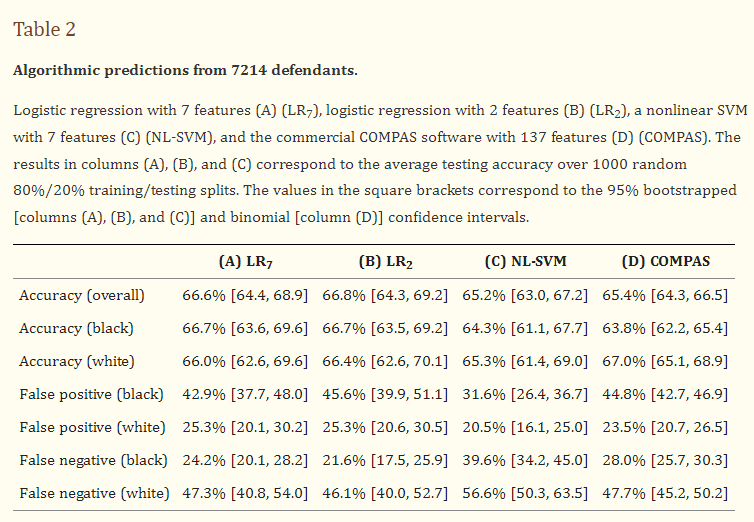

## 1. Are COMPAS scores racially biased?

According to an analysis of the ProPublica article "Machine Bias," COMPAS scores appear racially biased. My replication of their results confirms this bias, as the results I found were identical to those from the ProPublica article. However, it is essential to note that bias is complex and depends on the definition. One form of bias present in the data is 'Disparate impact.' This means that a higher percentage of 'African-American' defendants are classified as high-risk (values "high" or "medium") compared to 'Caucasian' defendants (58.82% for "African-American" and 34.8% for "Caucasian"). 'African-American' defendants also have a higher rate of false positive results (44.85%) and a lower rate of false negative results (27.99%) than 'Caucasian' defendants (23.45% and 47.72%). This indicates a bias favoring 'Caucasian' defendants. On the other hand, among the high-risk 'African-American' defendants, there are more who re-offend (62.97%), compared to high-risk 'Caucasian' defendants (59.13%) (thus a higher percentage of 'Caucasian' individuals were marked as "high/medium" when in reality were not). Conversely, among low-risk defendants, 65.05% of "African-American and 71.19% of "Caucasian" did not re-offend; this suggests a bias favoring 'African-American' defendants. However, these are not the only definitions of bias.

*Confusion matrix and other metrics for all defendants, black and white defendants, from ProPublica article.*

## 2. Is machine learning biased when using this data (are the classifications biased)?

**When using only the subset of features used in the Dressel 2018 article plus the race feature**

Using this dataset to train different machine learning models we can observe a significant amount of bias in the models predictions. The bias transferred from the data to the models can be seen with a higher percentage of 'African-American' defendants classified as high-risk (50.11% vs. 27.34% for "Caucasian"). There is also a higher rate of false positives (33.31% vs. 17.54%) and a lower rate of false negatives (34.03% vs. 57.56%) for 'African-American' defendants, all favoring "Caucasian" defendants. This means that the classifications obtained are biased according to the bias measurements we observed (disparate impact, equalized odds). Testing was performed using Logistic Regression, Random Forest, and Neural Network. The results were similar across all three models, with bias metrics provided for Logistic Regression.

*Distribution of predictions for 'African-American' (50.11% "yes") and 'Caucasian' (27.34% "yes") defendants using Logistic Regression.*

*True Negative Rates (blue) and False Positive Rates (red) for 'African-American' (33.31%) and 'Caucasian' (17.54%) defendants using Logistic Regression.*

*True Positive Rates (red) and False Negative Rates (blue) for 'African-American' (34.03%) and 'Caucasian' (57.56%) defendants using Logistic Regression.*

**When using all features**

*These results are from when all features from the COMPAS dataset are used to train the models. This is not the best approach, as some features, such as predictions from the COMPAS algorithm, are not available in real-world scenarios and boost the accuracy of the models significantly, reaching an AUC value of 0.99. This is not a realistic scenario, so the results above, using only a subset of features, better represent how a model trained on this data would look like.*

Models trained on the entire dataset, and not only the subset of features, are less biased. This can especially be seen in the TPR and FPR for "African-Americans" and "Caucasians", which are almost identical, both very close to 0. There is still some bias in the predictions, a higher percentage of 'African-American' defendants classified as high-risk (52.08% vs. 39.98% for "Caucasian") and a higher rate of false positives (2.73% vs. 1.48%) and a higher rate of false negatives for 'African-American' defendants (1.32% vs. 0.72%, which favors 'African-American defendants'), can be observed. This means that the classifications obtained are biased according to the bias measurements we observed (disparate impact, equalized odds). Testing was performed using Logistic Regression, Random Forest, and Neural Network. The results were similar across all three models, with bias metrics provided for Logistic Regression.

*Distribution of predictions for 'African-American' (52.08% "yes") and 'Caucasian' (39.98% "yes") defendants using Logistic Regression.*

*True Negative Rates (blue) and False Positive Rates (red) for 'African-American' (2.73%) and 'Caucasian' (1.48%) defendants using Logistic Regression.*

*True Positive Rates (red) and False Negative Rates (blue) for 'African-American' (1.32%) and 'Caucasian' (0.72%) defendants using Logistic Regression.*

## 3. Can we reproduce the results from the articles by Dressel and Farid 2018 and Rudin 2019 (references below)? 
- Dressel, J. & Farid, H. (2018). The accuracy, fairness, and limits of predicting recidivism. Science Advances, 4(1) https://www.ncbi.nlm.nih.gov/pmc/articles/PMC5777393/
- Rudin, C. (2019). Stop explaining black Box Machine Learning Models for High Stakes Decisions and Use Interpretable Models Instead. Nature Machine Intelligence, 1(5), 206-215. https://doi.org/10.1038/s42256-019-0048-x.
- Rudin C, Ustun B. Optimized Scoring Systems: Toward Trust in Machine Learning for Healthcare and Criminal
Justice. Interfaces. https://users.cs.duke.edu/~cynthia/docs/WagnerPrizeCurrent.pdf

I could not reproduce the results from the Dressel and Farid 2018 article. I tried to replicate the results in Orange3 using logistic regression on data with seven features and two features, like in the article. The accuracy results (66.8% overall, 66.5% black, 65.0% white for the seven features dataset) were very similar to those in the article (66.6% overall, 66.7% black, 66.0% white for the seven features dataset) for both, the seven and two feature version of the dataset. The false positive rates were around 10% lower than in the article, at 29.4% for blacks and 17.6% for whites, compared to 42.9% for blacks and 25.3% for whites in the article. On the other hand, the false negative rates were around 10% higher than in the article, at 37.6% for black and 57.3% for white compared to 24.2% for black and 47.3% for white from the article. I have double-checked these results in plain Python, and they were the same. The results for the SVM model were more similar to those from the article, but the same pattern was observed (lower false positive rates and higher false negative rates) on a smaller scale.
It should be noted that when trying to reproduce the results, I had some uncertainties about the data used in the article; some of the feature names from the seven feature datasets were not in the original COMPAS dataset. I think they have renamed some of the features. So, I had to guess which original features they were referring to, but after some trial and error and research, I am confident that I used the correct features. They also report the results for "black" and "white" instances, but the COMPAS dataset does not have these values in the race column, so I had to guess that "black" was referring to "African-American" and "white" to "Caucasian."

*The results from the article include overall accuracy and accuracy, false positive rate, and false negative rate for black ("African-American") and white ("Caucasian") instances separately.*

I also could not reproduce the results from Rudin 2019 article. For the CORELS model, I got an even simpler set of rules than in the article, consisting of only one if and one else statement. When trying to replicate the results of the risk-slim model, I got a different set of five scores than in the article. This might be because the authors used a different subset of features from the dataset, but that was not mentioned in the article, so I used the same seven features as in the Dressel 2018 article, which seems to be the standard.

*The results from my replication of the CORELS model, including just one rule to make classifications*

*The results from the article, including the rules for the CORELS model*

*The results from my replication of the RiskSLIM model, including the five scores for the model.*

*The results from the article, including the five scores for the model.*

I also tried to use a Scoring Sheet model from Orange3, which uses a FasterRisk model in the background, which is very similar to the risk-slim model, with some adjustments to make it faster. Interestingly, the Scoring Sheet model used "race=African-American" as one of the rules and gave it a negative effect on the score, which means that being "African-American" would decrease the chance of being classified as high-risk. This is counterintuitive. The reason for this, which I confirmed using logistic regression and a nomogram, is that there are "worse" races than "African-American" in the dataset (Caucasian not being one of them), and thus when using all races, the model would classify "African-American" as less risky than other.

## 4. Would we get different results if we excluded certain data, e.g., about race? 
- This is also related to whether it is possible to reliably predict race from other data about the defendant.

The results from the Dressel and Farid 2018 article would be the same if we excluded data about race since they did not use race data in their analysis. The results from the Rudin 2019 article would also be the same, as the explainable CORELS model and the RiskSLIM model do not use race to make predictions; this can be easily seen because of the nature of the models; they are straightforward and interpretable, so it is easy to see which features are used to make the predictions.

When excluding data about race from the COMPAS dataset when training any other ML model, the results (predictions) are almost identical to those when including data about race. This could mean two things: either the data about race are unimportant for the prediction, or race can be predicted from other data. The results would be the same in this case, as models would use other attributes to predict race. Attempting to predict race from other attributes yielded "poor" results, with an AUC less than 0.7, which means that race cannot be reliably predicted from other attributes. This suggests that data about race are unimportant for prediction, further confirmed by the results I obtained using a nomogram for logistic regression and by ranking the importance of attributes for a Random Forest model. In both, race was among the less important attributes for prediction.

*Feature importance for a Random Forest model trained on the COMPAS dataset calculated using the Rank Orange3 widget.*

*Nomogram for logistic regression trained on the COMPAS dataset, showing the importance of each feature for the prediction.*